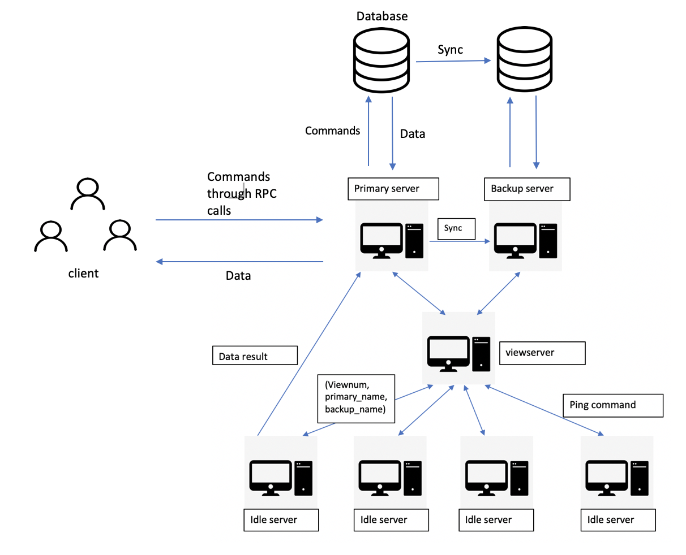
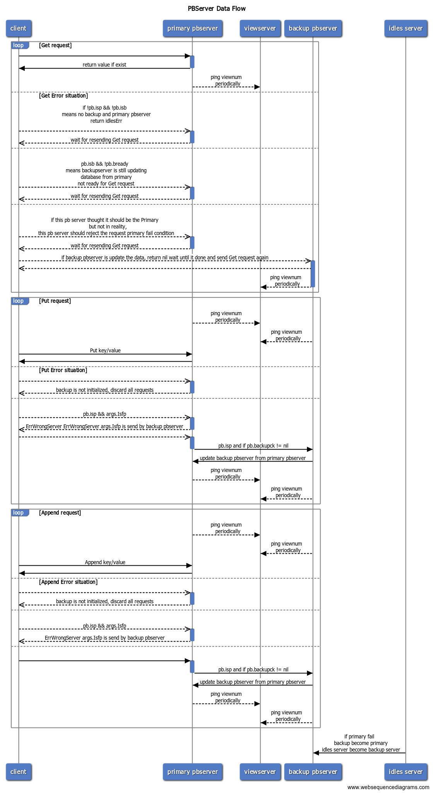

# Distributed_system_project
This project explored a primary/backup replication mechanism for a database system. The system consists a viewserver and a primary/backup service 

In this project, we explored a primary/backup replication mechanism for a database system. The motivation was based on the flaw of the single system, in which the main server could fail and the client would lose access to resources. In our design, we introduced a third component viewserver to monitor the availability of all servers in the network and made a replica from the master server. In an event of server failure, the viewserver would appoint backups to replace the failed server and keep all otherservers informed of the change.

A viewservice is responsible for monitoring the primary/backup and all other idle servers.
It will establish a primary and backup server by responding to ping requests.

The primary/backup service handles the client request on database and return the value to the client. It uses the viewserver to determine the primary server and to replace failed server.

Below is a diagram to show the overall system structure.

 

Below is a how the data flow in Clerk.Get(key) / Clerk.Put(key/value) / Clerk.Append(key/value) insides the PBServer. It shows how the primary and backup server communicate with each other and syncronize the its database.

 


# How to test
You can test the function of viewserver and P/B service independently. 

[Run viewserver test]:

Navigate ~ src/viewservice/
```go test```


[Test1. First Primary]

[Test2. First Backup]

[Test3. Backup takes over if primary fails]

[Test4. Restarted server becomes backup]

[Test5. Idle third server becomes backup if primary fails]

[Test6. Restarted primary treated as dead]

[Test7. Dead backup is removed from view]

[Test8. Viewserver waits for primary to ack view]

[Test9. Uninitialized server can't become primary]


[Run pbserver test]:

~ src/pbservice/
```export GOPATH=$HOME/6.824```
```go test```

TestBasicFail:

[Test1. Single primary, no backup]

[Test2. Add a backup]

[Test3. Count RPCs to viewserver]

[Test4. Primary failure]

[Test5. Kill last server, new one should not be active]

TestAtMostOnce:

[Test6. at-most-once Append; unreliable]

TestFailPut:

[Test7. Put() immediately after backup failure]

[Test8. Put() immediately after primary failure]

TestConcurrentSame:

[Test9. Concurrent Put()s to the same key]

TestConcurrentSameAppend:

[Test10. Concurrent Append()s to the same key]

TestConcurrentSameUnreliable:

[Test11. Concurrent Put()s to the same key; unreliable]

TestRepeatedCrash:

[Test12. Repeated failures/restarts]

TestRepeatedCrashUnreliable:

[Test13. Repeated failures/restarts with concurrent updates to same key; unreliable]

NetWork Partition test:

[Test14. Old primary does not serve Gets]

[Test15. Partitioned old primary does not complete Gets]


